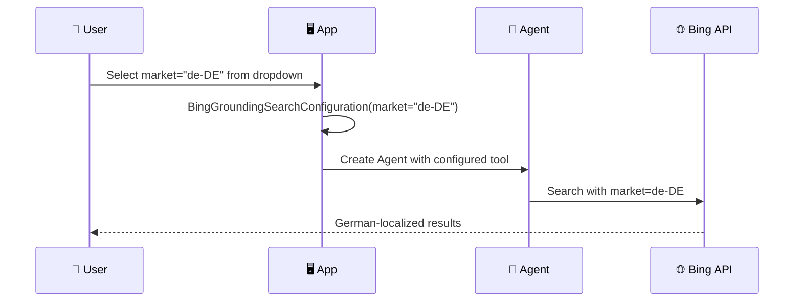
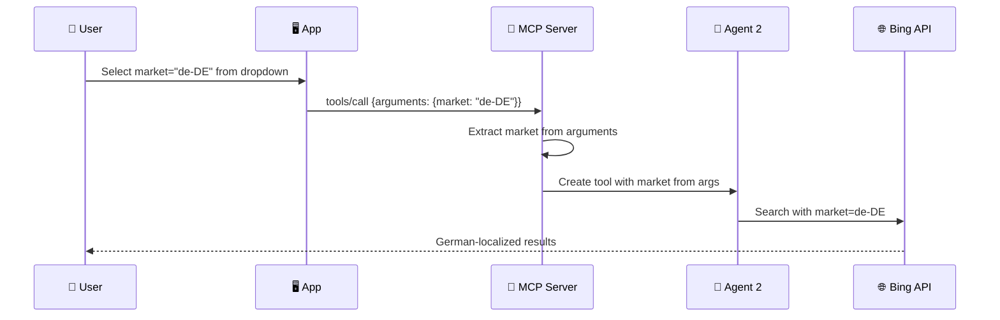

# Company Risk Analysis Agent - Bing Grounding PoC

This proof-of-concept application demonstrates Azure AI Foundry Agent with Bing Search grounding for comprehensive company risk analysis from an insurance perspective.

## 🎯 Purpose

The application analyzes companies for:
- General company details and background
- Involvement in litigations
- Negative news coverage (child labor, environmental issues, etc.)
- Overall risk profile assessment

## 🏗️ Two Scenarios for Market Parameter Testing

This PoC demonstrates **two architectures** for passing the market parameter to Bing Grounding:

### Scenario 1: Direct Agent with Bing Tool

User explicitly selects market from dropdown → Tool is configured with that market → Agent uses tool



### Scenario 2: Agent → MCP Server (Another Agent)

User selects market → Market passed as MCP tool argument → MCP Server creates tool dynamically



## 🔑 Key Technical Investigation: Market Parameter

This PoC specifically investigates how the `market` parameter works with Bing Grounding:

### Where is the Market Parameter Configured?

The `market` parameter is configured **at the tool level**, specifically in the `BingGroundingSearchConfiguration` when creating the Bing grounding tool:

```python
BingGroundingAgentTool(
    bing_grounding=BingGroundingSearchToolParameters(
        search_configurations=[
            BingGroundingSearchConfiguration(
                project_connection_id=connection_id,
                market="de-CH",  # <-- HERE: Configured per search configuration
                count=10,
                freshness="Month"
            )
        ]
    )
)
```

### How to Pass Market Explicitly (User Perspective)

| Scenario | How Market is Passed | When Tool is Configured |
|----------|---------------------|------------------------|
| **Direct Agent** | User selects from dropdown → Code creates tool with that market | At tool creation, before agent runs |
| **MCP Agent** | User selects from dropdown → Market sent as MCP argument | Dynamically when MCP request arrives |

### Default Behavior (No Market Specified)

If `market` is not specified:
- Bing uses an internal mapping based on the request origin
- Results may vary based on the Azure region of deployment
- For consistent results, **always specify the market explicitly**

### Supported Market Values

Examples:
- `en-US` - United States English
- `de-CH` - Switzerland German
- `fr-CH` - Switzerland French
- `de-DE` - Germany German
- `en-GB` - United Kingdom English

See [Bing Market Codes](https://learn.microsoft.com/en-us/bing/search-apis/bing-web-search/reference/market-codes) for full list.

## 📁 Project Structure

```
bing-foundry/
├── infra/                          # Infrastructure as Code
│   ├── main.bicep                  # Main Bicep template
│   ├── main.bicepparam             # Parameters file
│   └── modules/                    # Bicep modules
├── src/
│   ├── agent/
│   │   ├── __init__.py
│   │   ├── company_risk_agent.py   # Main agent logic
│   │   └── prompts.py              # Pre-baked prompts
│   ├── app.py                      # Streamlit UI (4 tabs)
│   └── config.py                   # Configuration
├── mcp-server/                     # MCP Server (Azure Functions)
│   ├── function_app.py             # MCP tools implementation
│   ├── host.json                   # MCP extension config
│   ├── requirements.txt
│   ├── infra/                      # Deployment infrastructure
│   └── README.md                   # MCP server documentation
├── mcp-server-local/               # 🆕 MCP Server (Local/Docker)
│   ├── mcp_server.py               # stdio transport
│   ├── mcp_server_http.py          # HTTP transport
│   ├── Dockerfile                  # Container image
│   └── Dockerfile.http             # HTTP server image
├── .vscode/
│   └── mcp.json                    # 🆕 VS Code MCP configuration
├── requirements.txt
├── .env.example
└── README.md
```

## 🚀 Quick Start

### 1. Prerequisites

- Azure subscription with Owner/Contributor access
- Azure CLI installed and logged in (`az login`)
- Python 3.10+
- Azure Developer CLI (azd) installed
- Git installed

### 2. Clone the Repository

```bash
git clone https://github.com/san360/bing-foundry.git
cd bing-foundry
```

### 3. Create Virtual Environment

**Windows (PowerShell):**
```powershell
# Create virtual environment
python -m venv .venv

# Activate virtual environment
.venv\Scripts\Activate.ps1

# Verify activation (should show .venv path)
Get-Command python | Select-Object Source
```

**Windows (Command Prompt):**
```cmd
# Create virtual environment
python -m venv .venv

# Activate virtual environment
.venv\Scripts\activate.bat
```

**macOS/Linux:**
```bash
# Create virtual environment
python3 -m venv .venv

# Activate virtual environment
source .venv/bin/activate

# Verify activation
which python
```

### 4. Deploy Infrastructure (Azure AI Foundry)

```bash
cd infra
azd up
```

This deploys to **Azure AI Foundry (Microsoft Foundry)**:
- AI Services account (`AIServices` kind) with GPT-4o deployment
- Grounding with Bing Search resource (`Microsoft.Bing/accounts`)
- Log Analytics Workspace for monitoring
- Storage Account for AI services

### 5. Create Bing Connection in AI Foundry Portal

1. Go to [Azure AI Foundry Portal](https://ai.azure.com)
2. Navigate to your project
3. Go to **Settings** → **Connections**
4. Click **+ New connection**
5. Select **Grounding with Bing Search**
6. Select your deployed Bing resource
7. Name the connection (e.g., `bing-grounding`)
8. Note the connection name for the next step

### 6. Configure Environment

```bash
# Copy example environment file
cp .env.example .env

# Edit .env with your values:
# - AZURE_AI_PROJECT_ENDPOINT: From AI Foundry portal (Project overview)
# - BING_PROJECT_CONNECTION_NAME: The connection name from step 5
```

**Finding your Project Endpoint:**
1. Go to [Azure AI Foundry Portal](https://ai.azure.com)
2. Select your project
3. Go to **Overview**
4. Copy the **Project endpoint** URL

### 7. Install Dependencies

```bash
# Ensure virtual environment is activated!
pip install -r requirements.txt
```

### 8. Run the Application

```bash
streamlit run src/app.py
```

### 9. Deactivate Virtual Environment (when done)

```bash
deactivate
```

## 🧪 Testing Market Parameter Behavior

The UI allows you to:
1. Enter a company name
2. Select a market (Switzerland, US, Germany, or "No Market")
3. View the pre-baked prompt
4. See how results differ based on market selection
5. Compare behavior with/without market specification

## 🏗️ Architecture: Azure AI Foundry Deployment

This solution uses **Azure AI Foundry** (formerly Azure AI Studio) for agent deployment:

```
┌─────────────────────────────────────────────────────────────┐
│                    Azure AI Foundry                         │
├─────────────────────────────────────────────────────────────┤
│  ┌─────────────────┐    ┌─────────────────────────────┐    │
│  │  AI Services    │    │  Bing Grounding Resource    │    │
│  │  (AIServices)   │◄───│  (Microsoft.Bing/accounts)  │    │
│  │                 │    │                             │    │
│  │  - GPT-4o Model │    │  - Grounding.Search         │    │
│  │  - Agent API    │    │  - Market Configuration     │    │
│  └────────┬────────┘    └─────────────────────────────┘    │
│           │                         ▲                       │
│           │     Connection          │                       │
│           └─────────────────────────┘                       │
└─────────────────────────────────────────────────────────────┘
                          │
                          ▼
              ┌───────────────────────┐
              │   Streamlit App       │
              │   (Python Client)     │
              │                       │
              │  - AIProjectClient    │
              │  - Agent Creation     │
              │  - Tool Configuration │
              └───────────────────────┘
```

**Key Components:**
- **AIServices Account**: Provides the GPT-4o model and Agent Service API
- **Bing Grounding Resource**: Enables real-time web search grounding
- **Project Connection**: Links Bing resource to AI Foundry project
- **Python SDK**: `azure-ai-projects` for agent interaction

## 📚 References

- [Azure AI Foundry Documentation](https://learn.microsoft.com/en-us/azure/ai-foundry/)
- [Bing Grounding Documentation](https://learn.microsoft.com/en-us/azure/ai-foundry/agents/how-to/tools/bing-tools)
- [Market Codes Reference](https://learn.microsoft.com/en-us/bing/search-apis/bing-web-search/reference/market-codes)
- [Azure AI Foundry Agents](https://learn.microsoft.com/en-us/azure/ai-foundry/agents/)
- [AI Projects Python SDK](https://learn.microsoft.com/en-us/python/api/overview/azure/ai-projects-readme)

---

## 🔌 MCP Server Integration

This project includes an **MCP (Model Context Protocol) server** that wraps the Bing Grounding functionality as reusable tools. This allows AI agents (like GitHub Copilot) to use Bing search with custom market parameters.

### Why MCP?

- **Standardized Interface**: MCP provides a protocol for AI agents to discover and use tools
- **Runtime Flexibility**: Pass market parameter at invocation time
- **Multiple Deployment Options**: Local, Docker, or Azure Functions

### Deployment Options

| Option | Transport | Use Case | Endpoint |
|--------|-----------|----------|----------|
| **Azure Functions** | HTTP Streamable | Production | `/runtime/webhooks/mcp` |
| **Local Docker** | HTTP | Development | `localhost:8000/mcp` |
| **Local Python** | stdio | VS Code testing | N/A (stdin/stdout) |
| **Azure Container Apps** | HTTP | Full control | Custom endpoint |

### Quick Start - Azure Functions

```bash
cd mcp-server
azd up
```

### Quick Start - Local Docker

```bash
cd mcp-server-local
docker build -f Dockerfile.http -t bing-mcp-server .
docker run -p 8000:8000 --env-file .env bing-mcp-server
```

### VS Code Integration

Configure in `.vscode/mcp.json` to use with GitHub Copilot:

```json
{
    "servers": {
        "bing-mcp": {
            "type": "http",
            "url": "https://<function-app>.azurewebsites.net/runtime/webhooks/mcp",
            "headers": {
                "x-functions-key": "<your-mcp-extension-key>"
            }
        }
    }
}
```

### Available MCP Tools

| Tool | Description |
|------|-------------|
| `bing_grounded_search` | Web search with market parameter |
| `analyze_company_risk` | Insurance risk analysis by category |
| `list_supported_markets` | List available market codes |

**Example Usage in Copilot:**
```
@workspace Search for "Tesla lawsuits 2024" using market de-DE with the Bing tool
```

For detailed MCP documentation, see [mcp-server/README.md](mcp-server/README.md).

---

## 📜 License

MIT License - See LICENSE file for details.

## 🤝 Contributing

1. Fork the repository
2. Create a feature branch
3. Commit your changes
4. Push to the branch
5. Create a Pull Request
