# MCP Server for Bing Grounding Search

This directory contains an MCP (Model Context Protocol) server that wraps the Bing Grounding functionality for use with AI agents. The server allows runtime configuration of the **market parameter** to get region-specific search results.

## 🎯 Overview

The MCP server exposes three tools:

| Tool | Description |
|------|-------------|
| `bing_grounded_search` | Perform web searches with Bing grounding |
| `analyze_company_risk` | Analyze company risks for insurance assessment |
| `list_supported_markets` | List available market codes |

## 🏗️ Architecture

### How Market Parameter Flows Through MCP

```mermaid
sequenceDiagram
    participant Client as 🖥️ Client App
    participant MCP as 🔌 MCP Server
    participant Handler as 📋 Tool Handler
    participant Agent as 🤖 AI Agent
    participant Bing as 🌐 Bing API
    
    Client->>MCP: POST /mcp<br/>{"method": "tools/call",<br/>"params": {"name": "analyze_company_risk",<br/>"arguments": {"market": "de-DE"}}}
    
    MCP->>Handler: Route to analyze_company_risk
    Handler->>Handler: Extract market="de-DE"<br/>from arguments
    Handler->>Agent: Create BingTool(market="de-DE")
    Agent->>Bing: Search with market=de-DE
    Bing-->>Agent: German-localized results
    Agent-->>MCP: Analysis response
    MCP-->>Client: MCP result
```



### Component Diagram

```mermaid
flowchart TB
    subgraph Clients["🖥️ MCP Clients"]
        C1[Streamlit App]
        C2[GitHub Copilot]
        C3[Custom Agent]
    end
    
    subgraph MCP["🔌 MCP Server"]
        E[HTTP Endpoint<br/>/mcp or /runtime/webhooks/mcp]
        T1[bing_grounded_search]
        T2[analyze_company_risk]
        T3[list_supported_markets]
    end
    
    subgraph Azure["☁️ Azure AI Foundry"]
        A[AI Agent<br/>GPT-4o]
        B[Bing Grounding<br/>Connection]
    end
    
    C1 & C2 & C3 -->|"market in args"| E
    E --> T1 & T2 & T3
    T1 & T2 -->|"market in config"| A
    A --> B
```



## 🚀 Deployment Options

### Option 1: Azure Functions (Recommended for Production)

Azure Functions provides a serverless, pay-per-use deployment with built-in MCP extension support.

```bash
# Deploy using Azure Developer CLI
cd mcp-server
azd up
```

**Endpoint:** `https://<function-app>.azurewebsites.net/runtime/webhooks/mcp`

### Option 2: Local Docker Container

Run the MCP server in a Docker container for development/testing.

```bash
# Build the image
cd mcp-server-local
docker build -f Dockerfile.http -t bing-mcp-server .

# Run with environment variables
docker run -p 8000:8000 \
  -e PROJECT_ENDPOINT="your-endpoint" \
  -e BING_CONNECTION_NAME="your-connection" \
  bing-mcp-server
```

**Endpoint:** `http://localhost:8000/mcp`

### Option 3: Local Python (stdio)

Run the MCP server locally using Python's stdio transport for VS Code integration.

```bash
cd mcp-server-local
pip install -r requirements.txt
python mcp_server.py
```

### Option 4: Azure Container Apps

Deploy to Azure Container Apps for full container control with autoscaling.

```bash
# Build and push to ACR
az acr build --registry <acr-name> --image bing-mcp-server:latest .

# Deploy to Container Apps
az containerapp create \
  --name bing-mcp-server \
  --resource-group <rg> \
  --image <acr-name>.azurecr.io/bing-mcp-server:latest \
  --target-port 8000 \
  --env-vars "PROJECT_ENDPOINT=<endpoint>" "BING_CONNECTION_NAME=<name>"
```

## 🔧 Configuration

### Environment Variables

| Variable | Required | Description |
|----------|----------|-------------|
| `PROJECT_ENDPOINT` | Yes | AI Foundry project endpoint URL |
| `BING_CONNECTION_NAME` | Yes | Bing connection name in AI Foundry |
| `MODEL_DEPLOYMENT_NAME` | No | Model to use (default: `gpt-4o`) |

### VS Code MCP Configuration

Add to your `.vscode/mcp.json`:

```json
{
    "servers": {
        "bing-mcp": {
            "type": "http",
            "url": "https://<your-function-app>.azurewebsites.net/runtime/webhooks/mcp",
            "headers": {
                "x-functions-key": "<your-mcp-extension-key>"
            }
        }
    }
}
```

## 📊 Comparison of Deployment Options

| Feature | Azure Functions | Docker Local | Azure Container Apps |
|---------|-----------------|--------------|---------------------|
| **Transport** | HTTP Streamable | HTTP POST/GET | HTTP POST/GET |
| **Scaling** | Automatic | Manual | Automatic |
| **Cost** | Pay-per-use | Free (local) | Pay-per-use |
| **Setup** | `azd up` | `docker run` | Azure CLI |
| **Auth** | System Key | Custom | Custom |
| **Best For** | Production | Development | Full control |

## 🔐 Authentication

### Azure Functions
- Uses system key `mcp_extension` by default
- Get key: `az functionapp keys list --name <app> --query "systemKeys.mcp_extension"`

### Docker/Container Apps
- Implement custom auth in code
- Can use Azure AD, API keys, etc.

## 🧪 Testing the MCP Server

### Using curl

```bash
# Initialize
curl -X POST http://localhost:8000/mcp \
  -H "Content-Type: application/json" \
  -d '{"jsonrpc":"2.0","id":"1","method":"initialize"}'

# List tools
curl -X POST http://localhost:8000/mcp \
  -H "Content-Type: application/json" \
  -d '{"jsonrpc":"2.0","id":"2","method":"tools/list"}'

# Call search tool
curl -X POST http://localhost:8000/mcp \
  -H "Content-Type: application/json" \
  -d '{
    "jsonrpc":"2.0",
    "id":"3",
    "method":"tools/call",
    "params":{
      "name":"bing_grounded_search",
      "arguments":{"query":"Tesla lawsuits 2024","market":"en-US"}
    }
  }'
```

### Using GitHub Copilot in VS Code

1. Configure MCP server in `.vscode/mcp.json`
2. Open Copilot Chat in Agent mode
3. Ask: "Search for Tesla lawsuits using the Bing tool with market de-DE"

## 🏗 Architecture

```
┌─────────────────────────────────────────────────────────────────┐
│                        AI Agent / Client                         │
│                    (GitHub Copilot, Custom Agent)                │
└──────────────────────────────┬──────────────────────────────────┘
                               │ MCP Protocol
                               ▼
┌─────────────────────────────────────────────────────────────────┐
│                      MCP Server Options                          │
├─────────────────┬─────────────────────┬─────────────────────────┤
│ Azure Functions │   Local Docker      │   Azure Container Apps  │
│  (HTTP Stream)  │    (HTTP)           │       (HTTP)            │
└────────┬────────┴──────────┬──────────┴───────────┬─────────────┘
         │                   │                      │
         └───────────────────┼──────────────────────┘
                             │
                             ▼
┌─────────────────────────────────────────────────────────────────┐
│                     AI Foundry Project                           │
│  ┌───────────────────┐    ┌───────────────────────────────────┐ │
│  │   Bing Grounding  │    │      AI Agent (GPT-4o)            │ │
│  │   Connection      │◄───│   - Creates temp agent            │ │
│  │   (market param)  │    │   - Runs search                   │ │
│  └───────────────────┘    │   - Returns grounded results      │ │
│                           └───────────────────────────────────┘ │
└─────────────────────────────────────────────────────────────────┘
```

## 📚 Related Documentation

- [Azure Functions MCP Extension](https://learn.microsoft.com/azure/azure-functions/functions-bindings-mcp)
- [MCP Protocol Specification](https://modelcontextprotocol.io/)
- [Bing Grounding in AI Foundry](https://learn.microsoft.com/azure/ai-foundry/agents/how-to/tools/bing-grounding)
